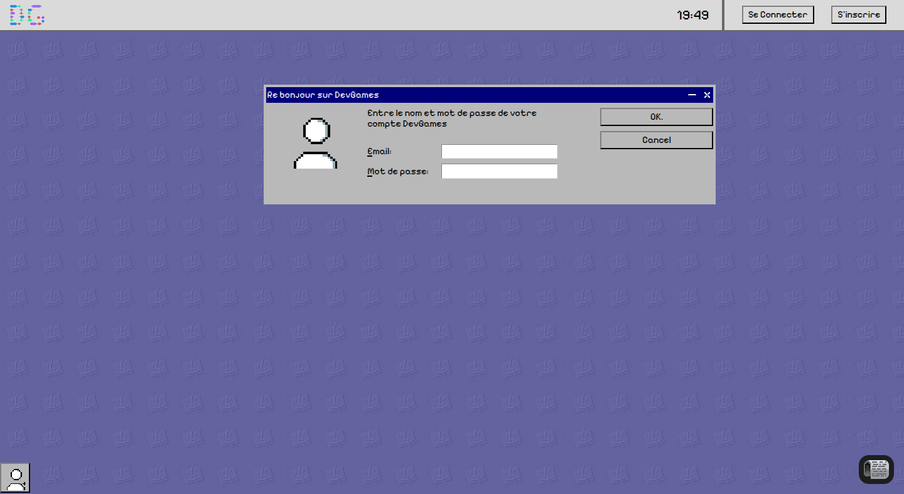

<h2 style='color: red'>Avez-vous déjà voulu apprendre à coder ?</h2>
<h3>👇 Si oui, je te conseille de lire la suite ! 👇</h3>

<h1>DevGames:</h1>

Grâce à DevGames, vous allez pouvoir apprendre de nombreux langages de programmation de manière ludique et amusante. 

<h3>❓ Comment ❓</h3>

En allant sur le site web ( qui sera disponible à la fin du dev ) pour apprendre le HTML & CSS. 
DevGames ne sera pas juste un site web mais un environnement pour apprendre à coder. 

- Vous voulez apprendre le développement web ? Allez sur le web.
- Vous voulez apprendre le c ? Jouer a un jeu dev en c
- ...

Toutes les plateformes qui vous permettront d'apprendre un langage seront codées avec le langage afin que vous accédez à l'environnement de votre langage mais aussi afin que je puisse apprendre ses langages de programmation.

Se projet en plus de vous permettre d'apprendre un langage de programmation, me permettra également d'apprendre des langages de programmation.

<h1>A quoi ça ressemble ?</h1>

Pour l'instant, je ne peux pas vous montrer beaucoup, mais ça ressemblera à ça.

J'ai decidé de faire un environnement de Macintosh car premièrement je trouve ça particulièrement beau, mais aussi pour passer une expérience réelle de pc, sans mettre en PLS votre navigateur web.

<h2>Mais alors, que ce que DevGames a de différents des autres sites ?</h2>

Je ne veux pas que vous vous ennuyez sur DevGames, je ne veux pas que vous apprenez avec du bourrage de crane. Je veux que vous soyez dans les meilleurs conditions pour apprendre. Que la science face en sorte que vous ayez toutes les chance que vous apprennez de la meilleure des manière.

Et surtout, je veux que vous passiez un bon moment sur DevGames. 

Pour en savoir sur les nouveautés de DevGames je vous invite à visiter https://dev-games-brown.vercel.app/ afin d'être tenu au courant.

A bientôt